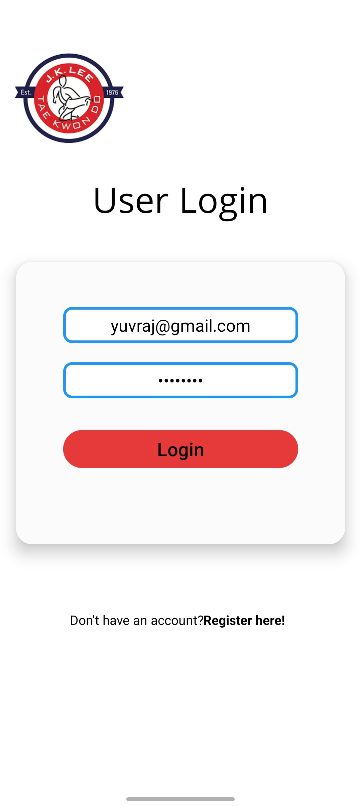
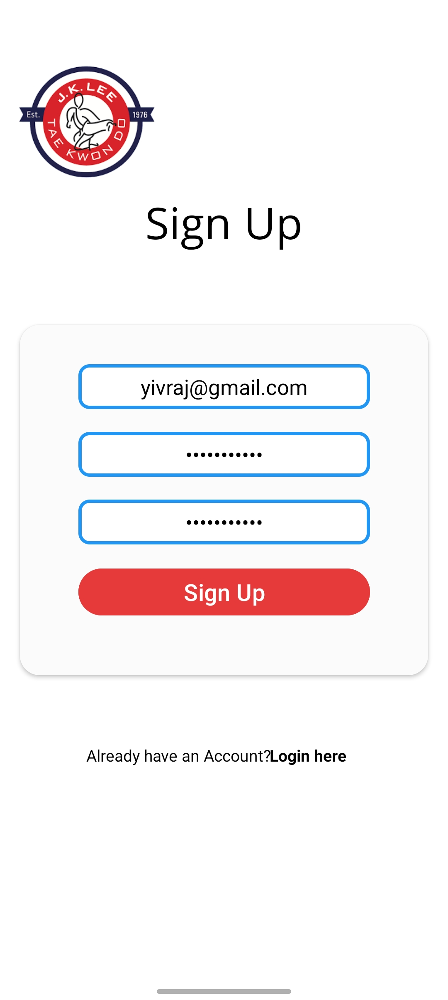
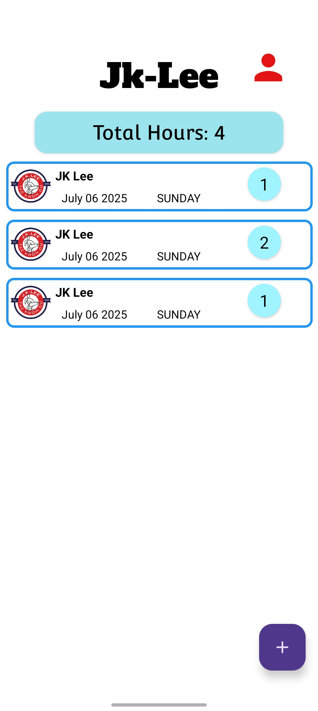
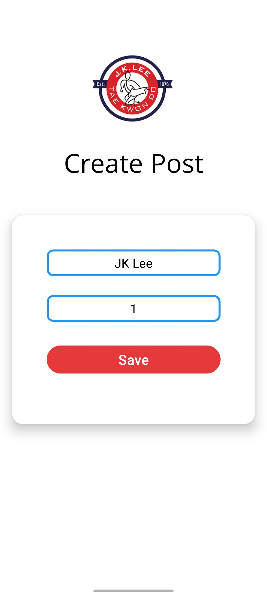
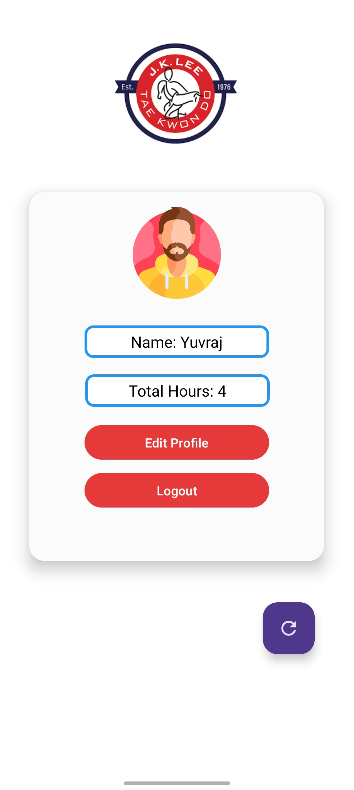

# JKLEE - Volunteer hours tracker

A minimilist mobile app to log and track volunteer hours across organizations built with **Kotlin**, **XML**, **Firebase authentication** and **Firestore database**

---

## Features

- **Hour logging**:
  - Add organizations and hours volunteered
  - View total aggregated hours across all entries

- **User Profiles**:  
  - Securely authenticated via Firebase.  
  - Personalized profile section.  

- **Clean UI**:  
  - Intuitive and clutter-free interface.  

---

## Technologies  

- **Frontend**: Kotlin, XML  
- **Backend**:  
  - Firebase Authentication (User sign-in/sign-up)  
  - Cloud Firestore (CRUD operations for hours/organizations)  

---

## Screenshots

| Login Screen | Signup Screen | Home Screen | Add Hours | Profile Screen | 
|--------------|---------------|-------------|-----------|----------------|
| |  |  |  |  |
---

